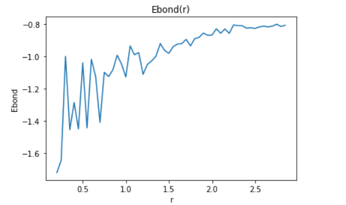
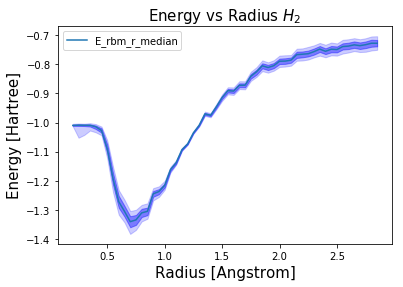
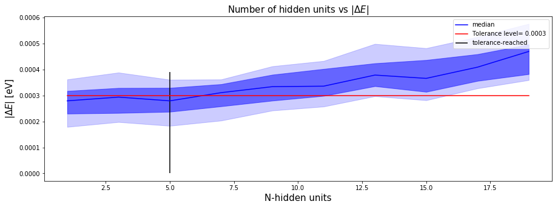
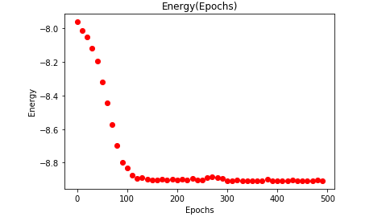
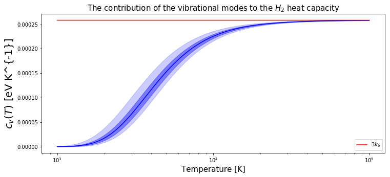
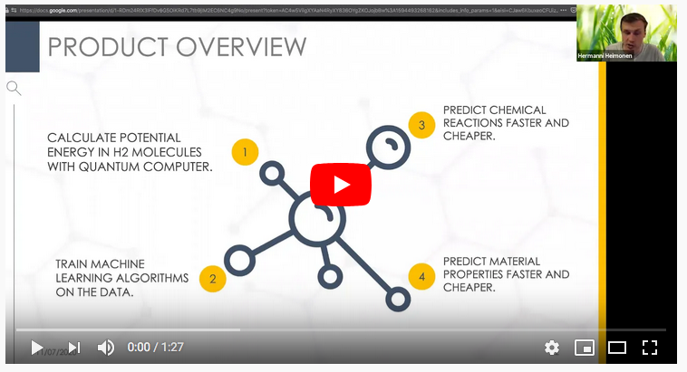

## Project 1: Machine Learning

This project will guide you through using a machine learning algorithm -- the Restricted Boltzmann machine (RBM) -- on molecular data. If you want some more machine learning exposure before you begin your tasks, supplemental reading on RBMs can be found [here](\href{https://qucumber.readthedocs.io/en/stable/_static/RBM_tutorial.pdf}), and a guide on training RBMs on a dummy dataset has been provided in a [Jupyter notebook](https://github.com/CDL-Quantum/CohortProject_2020/blob/master/Project_1_RBM_and_Tomography/RBM_train_dummy_dataset.ipynb). The base RBM code is located in [RBM_helper.py](https://github.com/CDL-Quantum/CohortProject_2020/blob/master/Project_1_RBM_and_Tomography/RBM_helper.py). We've intentionally left it to be bare-bones and easy to use.

Open up [Project1_LandingPage.pdf](https://github.com/CDL-Quantum/CohortProject_2020/blob/master/Project_1_RBM_and_Tomography/Project1_LandingPage.pdf) to begin learning about your tasks for this week!

## Tasks include:
* Train an RBM to reconstruct the potential energy of moleculary Hydrogen as the distance between the H atoms changes.
* Train an RBM to reconstruct the groundstate of a Rydberg atom quantum computer.

# Task 1 Notebook 

For Task 1 we had some difficulties starting as our energies didn't look quite correct and our notebook was the following  
[Task 1 Olgas V Jupyter notebook](https://github.com/olgOk/CohortProject_2020/blob/master/Project_1_RBM_and_Tomography/Task1_Olga_V.ipynb) 

After resolving these issues we investigated the energy-radius surface with uncertainties.  
[Task 1 Oscar JH Jupyter notebook](https://github.com/olgOk/CohortProject_2020/blob/master/Project_1_RBM_and_Tomography/Task1_Oscar_JH.ipynb) 

# Task 2 Notebook  
For Task 2, we analysed the convergence thresholds of the RBM reconstruction of Rydberg atoms
[ Task two notebook solutions](https://github.com/olgOk/CohortProject_2020/blob/master/Project_1_RBM_and_Tomography/Task2.ipynb)

# Additional challenges links
[RBM LiH challenge](https://github.com/olgOk/CohortProject_2020/blob/master/datasets/qubit_molecules/LiH/lithium_reconstruction.ipynb)   
In this notebook we compute several ground state properties of the LiH molecule such as binding energies and observe convergence properties.

[Material properties of the H2 Molecule](https://github.com/olgOk/CohortProject_2020/blob/oscar_JH_task_1_and_2/Project_1_RBM_and_Tomography/Physics_properties_of_the_H2_molecule.ipynb)  
In this notebook we use the data computed from the H2 molecule from task one to compute material properties of the H2 gas. 

[Training an RNN Challenge](https://github.com/olgOk/CohortProject_2020/blob/master/Project_1_RBM_and_Tomography/Train_RNN_Challenge2.ipynb)  
In this notebok we train an RNN to reproduce the wavefunction of the H2 molecule like in Task1.  

### Run on google colab for Task 1

## Further Challenges:
* Additional data has been provided for 
[LiH and BeH2](https://github.com/CDL-Quantum/CohortProject_2020/tree/master/datasets/qubit_molecules).
Consider an RBM reconstruction for these more complicated molecules.  What is the fundamental difference between these and the systems studied in the above Tasks?
* Explore other unsupervised machine learning techniques besides RBMs, such as recurrent neural networks (RNNs). Which can be used to represent molecular wavefunctions?
* What other quantum wavefunction datasets can you obtain? Is a “standard dataset” for machine learning quantum chemistry possible?
* D-Wave has included some data on a 
[hard optimization problem](https://github.com/CDL-Quantum/CohortProject_2020/tree/master/datasets/IsingSamplesDW). 
Can you use your machine learning skills to uncover the correlations between the Ising variables?

## Business Proposal 

Please find our 

## Business Application
For each week, your team is asked to complete a Business Application. Questions you will be asked are:

* Explain to a layperson the technical problem you solved in this exercise.
* Explain or provide examples of the types of real-world problems this solution can solve.
* Identify at least one potential customer for this solution - ie: a business who has this problem and would consider paying to have this problem solved.
* Prepare a 90 second video explaining the value proposition of your innovation to this potential customer in non-technical language.

For more details refer to the [Business Application found here](./Business_Application.md)
